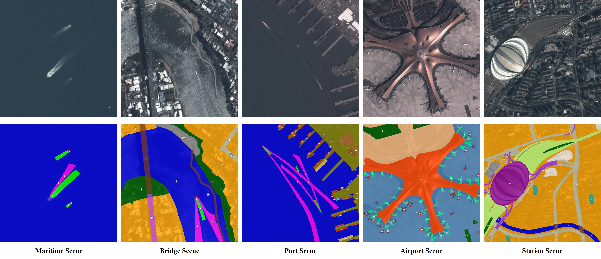

<h1 style="text-align: center;">T-STAR: A Large-Scale Benchmark for Spatio-Temporal Panoptic Scene Graph Generation in Satellite Video</h1>


## 📝 TPSG Task

<p align="center">
  <video src="demo/TPSGdemo.mp4" width="98%" controls>
  </video>
</p>

<p align="center">
  <em>Illustration of spatio-temporal panoptic scene graph generation (TPSG) in satellite video.</em>
</p>


## 🔖 T-STAR Dataset

We construct T-STAR, the first large-scale dataset for spatio-temporal panoptic scene graph generation(TPSG) in satellite video. Containing  more than  1.1 million instance masks and over 3.8 million spatio-temporal triplets across 39 fine-grained object categories and 70 fine-grained relationship categories.

<p align="center">
 
</p>


## 🖊️ Citation

If you find this work helpful for your research, please consider giving this repo a star ⭐ and citing our papers:

```bibtex
# SGG in Large-Size Satellite Imagery
@ARTICLE{STAR,
    author={Li, Yansheng and Wang, Linlin and Wang, Tingzhu and Yang, Xue and Luo, Junwei and Wang, Qi and Deng, Youming and Wang, Wenbin and Sun, Xian and Li, Haifeng and Dang, Bo and Zhang, Yongjun and Yu, Yi and Yan, Junchi},
    journal={IEEE Transactions on Pattern Analysis and Machine Intelligence}, 
    title={STAR: A First-Ever Dataset and a Large-Scale Benchmark for Scene Graph Generation in Large-Size Satellite Imagery}, 
    year={2025},
    volume={47},
    number={3},
    pages={1832-1849},
    keywords={Stars;Annotations;Marine vehicles;Satellite images;Visualization;Object detection;Cognition;Benchmark testing;Complexity theory;Bridges;Large-size satellite imagery;object detection;relationship prediction;scene graph generation benchmark},
    doi={10.1109/TPAMI.2024.3508072}}

```
## Acknowledgment
Our code is based on [OpenPVSG](https://github.com/LilyDaytoy/OpenPVSG) in CVPR'23, we sincerely thank them.

<!-- ## 📃 License

This project is released under the [Apache license](LICENSE). Parts of this project contain code and models from other sources, which are subject to their respective licenses. -->
